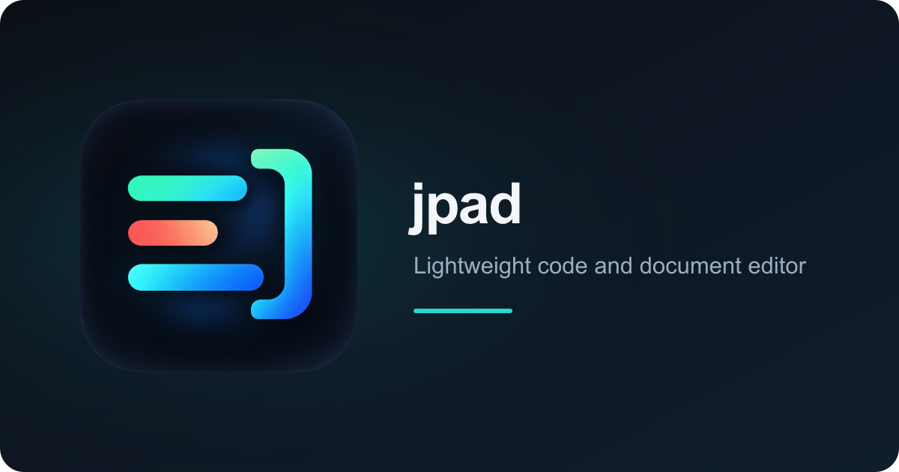

# jpad



> 한글 입력이 정확한 가벼운 코드 에디터 겸 문서·데이터 뷰어.
> A lightweight code editor and document/data viewer that gets Korean input right.

`jpad`는 실행 파일 하나로 동작하는 데스크톱 편집기입니다. 한글 조합 입력이 편집기와
터미널 모두에서 정상 동작하는 것을 출발점으로 삼았고, 마크다운 미리보기·CSV/Excel/SQLite
뷰어·줄 단위 검토 메모까지 한 창에서 다룹니다.

> **소스 비공개 안내:** jpad 소스 코드는 공개하지 않습니다. 이 저장소는 릴리스 바이너리,
> 사용 문서, 이슈 창구를 제공합니다. 바이너리 사용 조건은 [`LICENSE`](LICENSE)
> ([한국어 참고 번역](LICENSE.kr))를 따릅니다.

## 기능

| 영역 | 내용 |
|---|---|
| 편집 | 16개 언어 구문 강조(지연 로딩), 세로 탭 다중 파일, VSCode 수준 들여쓰기 |
| 한글 | 파일 경계 NFC 정규화, 조합 중 간섭 없음, 고정폭 정렬용 글꼴 선택 |
| 대용량 | 64MB를 넘는 파일은 3,000줄 단위 창으로 열고, 보이는 부분을 편집·저장 |
| 문서 | 마크다운 미리보기(mermaid, plotly, 이미지). `[제목](other.md)` 링크는 새 탭으로 열림 |
| 데이터 | CSV · TSV · Excel · SQLite 표 뷰어(페이지 단위 조회) |
| 검토 | `파일명.확장자.jpad` 사이드카에 줄 단위 메모·댓글. 원본은 바꾸지 않고, 여러 사람의 메모를 git이 자동 병합 |
| AI | 메모에 `@bot`을 넣으면 LLM이 리뷰어로 답변. 선택 영역 이어 쓰기·문법 교정·사용자 프롬프트(OpenAI 호환 엔드포인트) |
| 터미널 | `` Ctrl+` ``로 여는 PTY 셸 탭. 활성 파일의 폴더에서 시작 |
| 인코딩 | CP949 등 레거시 인코딩 읽기. BOM·LF/CRLF를 포함해 읽은 형식 그대로 저장 |
| 안전한 작업 | 외부 수정 자동 반영(편집 중이면 알림만), 저장하지 않은 내용까지 다음 실행 때 복원 |
| 검색 | 파일 안(`Ctrl+F`)과 열린 탭 전체(`Ctrl+Shift+F`). 정규식·단어 단위·일괄 치환 |
| 테마 | 밝게 · 어둡게 · 시스템 설정. 편집기와 터미널이 함께 바뀜 |

AI 기능은 사용자가 설정한 엔드포인트로만 요청합니다. API 키를 넣지 않으면 AI 기능 없이
편집기로만 동작합니다.

## 지원 플랫폼과 검증 상태

| | Windows x64 | Linux x64 | macOS | 모바일 |
|---|---|---|---|---|
| 배포 바이너리 | 준비 중 | 0.1.3 | 없음 | 없음 |
| 한글 IME (편집기·터미널) | 통과 | **미검증** | **미검증** | **미검증** |
| 편집·대용량 파일 | 통과 | **미검증** | **미검증** | **미검증** |

Windows 11 + WebView2 환경에서 검증했습니다. Linux 바이너리는 빌드와 프로세스 실행만 확인했고,
창 표시와 한글 입력은 확인하지 못했습니다. 특히 WebKitGTK + ibus/fcitx5 조합이 가장 위험합니다. Linux에서 써 보신
결과를 [이슈](https://github.com/jhl-labs/jpad-public/issues/new?template=bug_report.yml)로
알려 주시면 큰 도움이 됩니다.

## 설치

공개 릴리스는 [Releases](https://github.com/jhl-labs/jpad-public/releases)에 있습니다.
첫 공개 릴리스는 0.1.3입니다. Windows 실행 파일은 준비 중입니다.

- **Windows**: `jpad-<버전>-x64.exe` 하나를 받아 실행합니다. 설치 과정이 없고,
  필요한 런타임은 WebView2뿐입니다(Windows 11 기본 탑재).
- **Linux**: `jpad_<버전>_linux_amd64`를 받아 실행 권한을 주고 실행합니다.
  WebKitGTK 4.1 런타임이 필요합니다.

릴리스 바이너리에는 **코드 서명이 없습니다.** Windows에서는 SmartScreen 경고가 뜹니다.
받은 파일은 릴리스에 첨부된 `SHA256SUMS`로 확인하세요.

```powershell
# Windows
(Get-FileHash .\jpad-<버전>-x64.exe -Algorithm SHA256).Hash.ToLower()
```

```bash
# Linux
sha256sum -c SHA256SUMS --ignore-missing
```

## 사용법

- **파일 작업**: 왼쪽 패널 툴바 또는 `Ctrl+N` / `Ctrl+O` / `Ctrl+S`. 탐색기에서 끌어다 놓아도 열립니다.
- **그 밖의 명령**: 편집기에서 우클릭하거나 상단 `⋯` 메뉴. 메모, 검토 패널, 미리보기, 설정이 있습니다.
- **명령줄**: `jpad 파일`로 엽니다. 이미 실행 중이면 그 창에 탭으로 추가됩니다.
- **검토 메모**: 원본 대신 `파일명.확장자.jpad`에 쌓입니다. 원본과 함께 커밋하면 됩니다.
  새 파일은 한 번 저장해야 메모를 달 수 있습니다.
- **글꼴**: 한글 열을 맞추려면 한글 폭이 ASCII의 정확히 2배인 글꼴(D2Coding, Sarasa 등)을
  고르세요. `Ctrl+휠` · `Ctrl+＋/－`로 크기를 바꾸고 `Ctrl+0`으로 되돌립니다.
- **대용량 파일**: 64MB를 넘으면 창 단위로 편집합니다. 다른 부분으로 옮기기 전에 저장하세요.
  실행 취소 기록도 창과 함께 사라집니다.
- **인코딩**: 상태 표시줄 오른쪽(`UTF-8 · LF`)을 누르면 다른 인코딩이나 줄 끝으로 바꿔 저장합니다.
- **저장하지 않은 내용**: 입력을 멈추면 잠시 뒤 초안이 앱 설정 폴더에 저장되고 다음 실행 때
  돌아옵니다. 원본 파일에는 쓰지 않습니다.
- **이동·바꾸기·인쇄**: `Ctrl+G` 줄 이동, `Ctrl+H` 바꾸기, `Ctrl+P` 인쇄.

## 피드백

- 버그: [Bug report](https://github.com/jhl-labs/jpad-public/issues/new?template=bug_report.yml)
- 기능 제안: [Feature request](https://github.com/jhl-labs/jpad-public/issues/new?template=feature_request.yml)
- 질문: [Question](https://github.com/jhl-labs/jpad-public/issues/new?template=question.yml)
- 보안 취약점: 공개 이슈 대신 [`SECURITY.md`](SECURITY.md)의 비공개 신고 경로를 사용하세요.

이슈에 실제 문서 내용, API 키, 개인 경로를 넣지 마세요. 재현에는 최소한의 예시 파일을 사용해 주세요.

## English summary

`jpad` is a single-binary desktop editor (Tauri) focused on correct Korean IME input. It
combines a code editor (16 languages), a Markdown preview with mermaid/plotly, CSV/TSV/Excel/SQLite
viewers, line-anchored review notes stored in `.jpad` sidecar files, an optional LLM reviewer via
any OpenAI-compatible endpoint, a PTY terminal tab, encoding-preserving saves, and windowed
editing for files larger than 64MB.

Verified on Windows 11 + WebView2. The Linux build (0.1.3) has only been checked to build and
start; window rendering and Korean input with WebKitGTK + ibus/fcitx5 are not yet verified. A
Windows build of 0.1.3 is in preparation. Binaries are unsigned; verify them with the
attached `SHA256SUMS`. The source code is private; this repository hosts releases, docs, and
issues. See [`LICENSE`](LICENSE) for binary usage terms.
